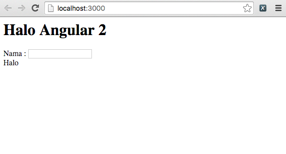
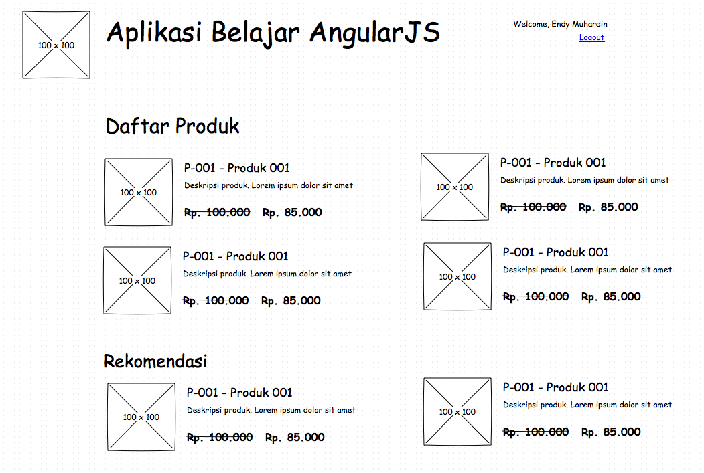
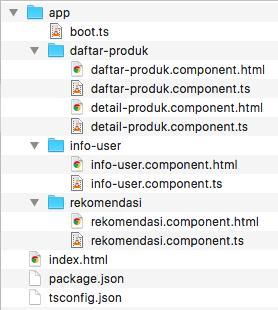

# Belajar AngularJS 2.0 #

## Langkah-langkah pembuatan Hello World ##

1. [Instalasi NodeJS dan
   NPM](http://software.endy.muhardin.com/javascript/persiapan-coding-nodejs)
2. [Instalasi TypeScript](#instalasi-typescript)
3. [Inisialisasi Struktur Project](#inisialisasi-struktur-project)
4. [Menjalankan Aplikasi](#menjalankan-aplikasi)
5. [Konfigurasi Aplikasi JavaScript](#konfigurasi-aplikasi-javascript)
6. [Membuat Template HTML](#membuat-template-html)
7. [Implementasi Komponen Angular 2](#implementasi-komponen-ng2)

### <a name="instalasi-typescript">Instalasi TypeScript</a> ###

AngularJS 2.0 menggunakan bahasa pemrograman TypeScript, yaitu pengembangan dari JavaScript. Nama resmi JavaScript adalah ECMAScript, dan versi yang saat ini terinstal di browser pada umumnya adalah versi 5. Saat ini yang sedang dikembangkan adalah versi 6. Berikut adalah beberapa poin penting mengenai TypeScript:

* TypeScript adalah superset dari ES6, sedangkan ES6 adalah superset dari ES5. Artinya, kita bisa menulis ES5 di kode program ES6, dan kita bisa menulis kode program ES6 dan ES5 di dalam TypeScript dan tidak akan error.
* TypeScript dikembangkan oleh Microsoft
* AngularJS versi 2.0 menggunakan TypeScript sebagai bahasa pemrograman utama. Kita juga bisa membuat aplikasi AngularJS 2.0 dengan bahasa ES5, ES6, ataupun Dart.
* Sebelum dirilis, TypeScript juga dikenal dengan istilah AtScript.
* TypeScript harus diubah dulu (transpile) menjadi ES5 supaya bisa dijalankan di browser.
* TypeScript menambahkan beberapa fitur dari ES6, yaitu:

    * static typing : tipe data ditulis secara eksplisit dan diperiksa pada waktu kompilasi
    * annotations / decorator : mirip dengan annotations di Java. Yaitu metadata yang dipasang di kode program dan akan diproses pada waktu aplikasi dijalankan.
    * karena memiliki type system, maka lebih banyak editor yang bisa menawarkan fitur autocomplete dan pemeriksaan error pada waktu kita mengetik

Untuk menginstal TypeScript, terlebih dulu kita harus menginstal NodeJS dan NPM. Selanjutnya, instalasi dilakukan dengan perintah berikut:

```
npm install -g typescript
```

Selanjutnya, untuk mengetes instalasi kita dan melihat cara kerja transpiler TypeScript, buatlah folder kosong dengan nama `belajar-typescript`.

```
mkdir belajar-typescript
cd belajar-typescript
```

Kemudian, buat file halo.ts di dalam folder tersebut dengan isi sebagai berikut:

```ts
var nama: string = "Endy";
```

Selanjutnya, jalankan transpiler untuk mengkompilasi file `halo.ts`

```
tsc halo.ts
```

Dia akan membuat file baru dengan nama `halo.js` yang berisi sebagai berikut:

```js
var nama = "Endy";
```

Seperti kita lihat di atas, kode program JavaScript yang dihasilkan tidaklah istimewa. Kode program JavaScript biasa.

Kita juga bisa menjalankan transpiler untuk selalu memantau file `.ts` sehingga kita tidak perlu menjalankan kompilasi setiap file diedit. Jalankan `tsc` dengan opsi `-w` (watch)

```
tsc -w *.ts
```

Kita bisa melihat fitur type system pada TypeScript dengan cara mengisi nilai angka ke dalam variabel nama (yang sudah dideklarasikan dengan tipe data `string`). Ubah file `halo.ts` menjadi seperti ini:

```ts
var nama: string = "Endy";
nama = 123;
```

Bila kita perhatikan transpiler, dia akan mengeluarkan pesan error seperti ini

```
File change detected. Starting incremental compilation...
halo.ts(2,1): error TS2322: Type 'number' is not assignable to type 'string'.
```

Dari pesan error di atas, kita bisa lihat bahwa variabel `nama` tidak bisa diisi dengan nilai `123` karena tipe datanya berbeda.

Lebih lanjut mengenai bahasa TypeScript dapat dipelajari pada [tutorial resmi di websitenya](http://www.typescriptlang.org/Tutorial).

### <a name="inisialisasi-struktur-project">Inisialisasi Struktur Project</a> ###

Langkah pertama tentunya kita buat dulu folder projectnya.

```
mkdir belajar-angular2
cd belajar-angular2
```

Ada dua file konfigurasi yang dibutuhkan dalam project TypeScript:

* `package.json` : Konfigurasi dependency management untuk mencatat daftar package/library yang dibutuhkan. File ini digunakan oleh `npm` untuk mengunduh dan memasang library tambahan yang kita butuhkan dalam aplikasi yang akan kita buat.
* `tsconfig.json` : Konfigurasi transpiler TypeScript. Adanya file ini menunjukkan bahwa folder ini merupakan project TypeScript.

Untuk membuat file `package.json`, kita jalankan perintah `npm init`. Berikut hasilnya

```
npm init
This utility will walk you through creating a package.json file.
It only covers the most common items, and tries to guess sensible defaults.

See `npm help json` for definitive documentation on these fields
and exactly what they do.

Use `npm install <pkg> --save` afterwards to install a package and
save it as a dependency in the package.json file.

Press ^C at any time to quit.
name: (belajar-angular2) 
version: (1.0.0) 
description: Aplikasi Belajar AngularJS 2.0
entry point: (index.js) js/aplikasi.js
test command: 
git repository: https://github.com/endymuhardin/belajar-angular2
keywords: 
author: Endy Muhardin
license: (ISC) CC-BY-SA-4.0
About to write to /Users/endymuhardin/workspace/belajar/belajar-angular2/package.json:

{
  "name": "belajar-angular2",
  "version": "1.0.0",
  "description": "Aplikasi Belajar AngularJS 2.0",
  "main": "js/aplikasi.js",
  "scripts": {
    "test": "echo \"Error: no test specified\" && exit 1"
  },
  "repository": {
    "type": "git",
    "url": "git+https://github.com/endymuhardin/belajar-angular2.git"
  },
  "author": "Endy Muhardin",
  "license": "CC-BY-SA-4.0",
  "bugs": {
    "url": "https://github.com/endymuhardin/belajar-angular2/issues"
  },
  "homepage": "https://github.com/endymuhardin/belajar-angular2#readme"
}


Is this ok? (yes) 
```

Untuk saat ini, kita belum melakukan modifikasi terhadap file tersebut. Selanjutnya, kita buat file konfigurasi satu lagi yaitu `tsconfig.json`.

```
tsc --init
```

Dia akan membuatkan file `tsconfig.json`.

Selanjutnya, kita akan melakukan modifikasi terhadap file `package.json`. Tambahkan bagian script sehingga menjadi seperti ini

```js
  "scripts": {
    "tsc": "tsc",
    "tsc:w": "tsc -w",
    "lite": "lite-server",
    "start": "concurrent \"npm run tsc:w\" \"npm run lite\" "
  }
```

Dengan konfigurasi di atas, kita bisa menjalankan perintah `npm start` dari folder project. Perintah ini akan menjalankan dua perintah secara berbarengan (concurrent), yaitu `npm run tsc:w` dan `npm run lite`.
Perintah `tsc:w` sendiri sebetulnya adalah alias dari `tsc -w`, sedangkan `lite` adalah alias dari `lite-server`, yaitu web server kecil.
Perintah `npm start` ini sama saja dengan kita membuka dua console command line, kemudian menjalankan `tsc -w` dan `lite-server` di masing-masing console tersebut.

Selanjutnya, tambahkan bagian `dependencies` agar memuat library AngularJS, SystemJS, dan kelengkapan lainnnya

```js
  "dependencies": {
    "angular2": "2.0.0-beta.0",
    "systemjs": "0.19.6",
    "es6-promise": "^3.0.2",
    "es6-shim": "^0.33.3",
    "reflect-metadata": "0.1.2",
    "rxjs": "5.0.0-beta.0",
    "zone.js": "0.5.10"
  }
```

Tambahkan juga `devDependencies` untuk paket yang hanya digunakan selama development.

```js
  "devDependencies": {
    "concurrently": "^1.0.0",
    "lite-server": "^1.3.1",
    "typescript": "^1.7.3"
  }
```

Setelah membuat file `package.json` jalankan perintah `npm install` supaya `npm` mengunduh dan menginstal library yang kita tulis di `package.json tersebut`.


Untuk file `tsconfig.json`, berikut isi filenya

```js
{
  "compilerOptions": {
        "target": "es5",
        "module": "system",
        "moduleResolution": "node",
        "sourceMap": true,
        "emitDecoratorMetadata": true,
        "experimentalDecorators": true,
        "removeComments": false,
        "noImplicitAny": false
    },
    "exclude": [
        "node_modules"
    ]
}
```

Berikut penjelasannya:

* `target` : hasil transpile. Kita output menjadi ES5 agar bisa dijalankan semua browser.
* `module` : ini adalah sistem untuk load beberapa file `js` dalam project. Dalam contoh ini, kita menggunakan SystemJS. Selain SystemJS, ada juga beberapa alternatif lain misalnya: RequireJS, Browserify, WebPack, CommonJS, AMD, dan sebagainya.
* `moduleResolution` : ada dua opsi : classic dan node. Untuk TypeScript versi 1.6 ke atas, gunakan `node`
* `sourceMap` : opsi supaya compiler menghasilkan file `map`. File ini dibutuhkan agar kita bisa menelusuri pesan error di browser ke baris kode TypeScript (bukan ke JavaScript hasil compile)
* `emitDecoratorMetadata` : menulis informasi tentang anotasi di file hasil kompilasi
* `experimentalDecorators` : ini adalah konfigurasi agar Visual Studio Code tidak menampilkan pesan error untuk anotasi / decorator yang masih experimental
* `removeComments` : hilangkan semua komentar dari file hasil kompilasi
* `noImplicitAny` : bila nilainya false, maka compiler akan menganggap variabel yang tidak memiliki deklarasi tipe data menjadi tipe data `any`. Bila nilainya `true`, compiler akan mengeluarkan pesan error.
* `exclude` : file / folder yang tidak akan diproses oleh compiler


### <a name="menjalankan-aplikasi">Menjalankan Aplikasi</a> ###

Selanjutnya, kita akan membuat file `index.html` untuk aplikasi kita. Pada awalnya, file ini berisi seperti ini:

```html
<html>    
    <head>
        <title>Halo Angular 2</title>        
    </head>
    
    <body>        
        <h1>Halo Angular 2</h1>        
        Nama : <input type="text"> <br />        
        Halo <pengunjung></pengunjung>        
    </body>
</html>
```

Setelah kita memiliki `index.html`, kita bisa mencoba konfigurasi aplikasi kita. Jalankan aplikasi dengan perintah berikut:

```
npm start
```

Outputnya akan terlihat seperti ini

```
> belajar-angular2@1.0.0 start /Users/endymuhardin/workspace/belajar/belajar-angular2
> concurrent "npm run tsc:w" "npm run lite" 

[0] 
[0] > belajar-angular2@1.0.0 tsc:w /Users/endymuhardin/workspace/belajar/belajar-angular2
[0] > tsc -w
[0] 
[1] 
[1] > belajar-angular2@1.0.0 lite /Users/endymuhardin/workspace/belajar/belajar-angular2
[1] > lite-server
[1] 
[1] [BS] Access URLs:
[1]  --------------------------------------
[1]        Local: http://localhost:3000
[1]     External: http://192.168.1.193:3000
[1]  --------------------------------------
[1]           UI: http://localhost:3001
[1]  UI External: http://192.168.1.193:3001
[1]  --------------------------------------
[1] [BS] Serving files from: ./
[1] [BS] Watching files...
[0] 10:08:12 PM - Compilation complete. Watching for file changes.
[1] 15.12.27 22:08:13 200 GET /./index.html (Unknown - 141ms)
[1] 15.12.27 22:08:13 404 GET /favicon.ico (Unknown - 28ms)
[1] [BS] File changed: index.html
[1] 15.12.27 22:10:29 200 GET /./index.html (Unknown - 7ms)
```

Perintah tersebut juga akan membuka browser dan menampilkan isi file `index.html` seperti ini



### <a name="konfigurasi-aplikasi-javascript">Konfigurasi Aplikasi JavaScript</a> ###

Kita perlu melakukan beberapa hal dalam `index.html` yaitu:

* load javascript yang dibutuhkan
* bootstrap aplikasi kita sesuai tatacara SystemJS

Mari kita lakukan yang pertama dulu. Tambahkan kode program berikut

```html
<!-- 1. Load JavaScript -->
<script src="node_modules/angular2/bundles/angular2-polyfills.js"></script>
<script src="node_modules/systemjs/dist/system.src.js"></script>
<script src="node_modules/rxjs/bundles/Rx.js"></script>
<script src="node_modules/angular2/bundles/angular2.dev.js"></script>
```

Ada beberapa script yang diload pada baris kode di atas:

* Angular Polyfills : ini adalah library tambahan yang dipasang supaya kode program AngularJS bisa dijalankan di berbagai browser, bahkan yang belum mendukung fitur-fitur ES6. Script polyfill akan menambahkan fitur yang belum ada di browser.
* System JS : ini adalah library yang tugasnya sebagai loader, yaitu mengaktifkan berbagai file JavaScript yang kita tulis. Untuk kemudahan pemrograman, biasanya kita membagi kode program ke banyak file. Sedangkan pada waktu dijalankan, browser lebih suka file yang lebih sedikit. Library loader mengatasi masalah ini, sehingga kita bisa membagi kode program ke banyak file, tapi pada waktu dijalankan, dia akan menggabungkannya menjadi satu.
* Rx.js adalah implementasi Reactive Architecture dalam JavaScript, yaitu model pemrograman yang pola pikirnya adalah menangani event yang terjadi (_react to events_).
* Angular 2 : ini adalah library AngularJS versi 2 yang pada saat artikel ini ditulis masih berstatus Beta (belum rilis Stable)

Sebelum masuk ke pembahasan tentang SystemJS, perlu kita ketahui dua istilah penting dalam dunia JavaScript, yaitu `module` dan `module loader`.

Penjelasan tentang `module` bisa dibaca di [artikel ini](https://www.airpair.com/javascript/posts/the-mind-boggling-universe-of-javascript-modules). Intinya adalah:

* Untuk membuat aplikasi besar, idealnya kode program dibagi ke dalam modul. Konsep ini universal, bahasa pemrograman manapun perlu sistem modul agar bisa membuat aplikasi berskala besar. Tanpa sistem modul, kode program kita akan campur aduk dan sulit dimaintain.
* Ada beberapa sistem modul yang populer di dunia JavaScript:

    * CommonJS
    * AMD (Asynchronous Module Definition)
    * ESM (ECMAScript Module), sebelumnya dikenal dengan istilah `es6`

Bila kita menggunakan framework JavaScript modern seperti AngularJS, EmberJS, Marionette, atau React, pastilah kita akan menemui sistem modul ini.

Seperti lazimnya di dunia pemrograman, bila ada beberapa alternatif format/standar, akan muncul library untuk menyatukannya. Untuk kasus modul ini, jenis librarynya bernama _module loader_. Ada beberapa module loader yang populer, diantaranya:

* browserify
* webpack
* SystemJS
* jspm, yang dibangun di atas SystemJS

Saat tulisan ini dibuat, yang sedang naik daun adalah WebPack dan SystemJS. Bagi yang tertarik pada perbandingan di antara mereka bisa membaca artikel berikut:

* [Perbandingan Browserify dan Webpack](http://blog.namangoel.com/browserify-vs-webpack-js-drama)
* [Perbandingan Webpack dan JSPM](http://ilikekillnerds.com/2015/07/jspm-vs-webpack/)
* [Perbandingan Browserify, Webpack, SystemJS, dan JSPM](http://nervosax.com/2015/08/05/why-not-try-jspm-and-systemjs/)

Manapun yang lebih baik, sebetulnya tidak terlalu masalah. Keempat library di atas hanyalah bertugas melakukan module loading, dan kode programnya pun hanya beberapa baris saja. Kita bisa menggantinya dengan mudah dan cepat, oleh karena itu tidak perlu terlalu diributkan.

Untuk contoh kode program, kita akan menggunakan SystemJS. Alasannya karena itulah yang dicontohkan di website AngularJS. Pada fase belajar, sangat penting kita tidak mengubah banyak hal sekaligus, supaya tidak banyak yang kita pusingkan.

Langkah berikutnya, kita perlu menentukan bagaimana struktur folder aplikasi kita. Angular 2 sangat mengedepankan masalah komponen. Jadi, kita harus memikirkan aplikasi kita dengan pola pikir komponen. Sebuah komponen terdiri dari:

* template HTML (view)
* kode program JavaScript untuk memanipulasi komponen tersebut (controller)
* data yang akan ditampilkan dalam template (model)

Sebagai contoh, bila aplikasi kita memiliki tampilan seperti ini



maka kita bisa membaginya menjadi beberapa komponen:

* InfoUser
* DaftarProduk
* Rekomendasi

Aplikasi di atas akan dibangun dengan struktur folder seperti ini



Kita juga tambahkan satu folder `halo` di dalam `app` untuk membuat komponen `hello-world`.

Selanjutnya, kita akan membuat konfigurasi SystemJS untuk menjalankan aplikasi kita dan mengaktifkan komponen `hello-world` ini. Berikut adalah kode programnya.

```html
<!-- 2. Load Aplikasi -->
<script>
System.config({
    packages: {        
        app: {
            format: 'register',
            defaultExtension: 'js'
        }
    }
});
System.import('app/boot')
        .then(null, console.error.bind(console));
</script>
```

Penjelasan dari baris kode tersebut adalah:

* Kita mendaftarkan packages bernama `app`. Lokasinya berada di `$baseURL/app`. Sedangkan `$baseURL` artinya lokasi dimana `index.html` berada.
* Format modulnya menggunakan skema `register`. Ini artinya, di awal file ada baris kode untuk mendaftarkan modul ke SystemJS. Biasanya ditandai dengan perintah `System.register` atau `System.registerDynamic`. Bila kita kompilasi dengan TypeScript, biasanya perintah registrasi ini sudah otomatis ditambahkan.
* File-file dalam modul ini berakhiran `.js`. Ini artinya yang dibaca dan diproses oleh SystemJS adalah file `.js` hasil kompilasi, bukan kode program TypeScript yang kita tulis.
* Baris perintah `System.import` menjalankan modul aplikasi kita.
* File yang dijalankan adalah `boot.js` yang berada dalam folder `app`.
* File `boot.js` ini adalah hasil kompilasi dari `boot.ts`

Untuk pengembangan ke depan, kita bisa otomasi proses ini lebih jauh dengan menggunakan `jspm`. Dengan `jspm`, bila kita menggunakan berbagai library tambahan, kita bisa instal dengan mudah menggunakan `jspm`. Ini disebut dengan dependency management, mirip dengan Maven di Java, npm di JavaScript, composer di PHP, ataupun Bower untuk CSS dan JavaScript.

> Apa bedanya `jspm` dengan `bower`?

Bower cuma mengurusi download dependensi saja. Sedangkan JSPM, selain mendownload file, dia juga memasang file tersebut dan mengurusi tata cara loading modulnya.

Kita tidak akan membahas lebih jauh tentang JSPM. Bila Anda tertarik, bisa simak dulu cara pakai dan kegunaannya di [video ini](https://youtu.be/iukBMY4apvI).

### <a name="membuat-template-html">Membuat Template HTML</a> ###

### <a name="membuat-komponen-ng2">Membuat Komponen AngularJS 2.0</a> ###

## Tools ##

* [Visual Studio Code]()
* [Atom Editor]() dengan [package AngularJS 2.0]() 


## Referensi ##

* [AngularJS 2.0 Quickstart](https://angular.io/docs/ts/latest/quickstart.html)
* [Arsitektur Aplikasi AngularJS
  2](https://angular.io/docs/ts/latest/guide/architecture.html)
