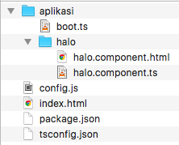
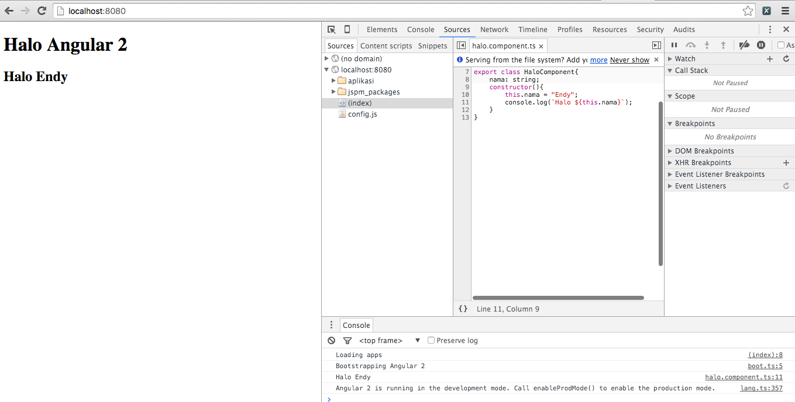
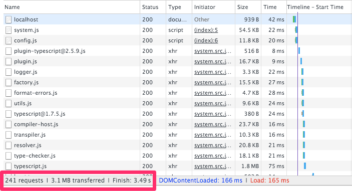

# Setup Project Angular 2 dengan JSPM #

## Instalasi JSPM ##

```
npm install -g jspm
```

## Membuat Struktur Folder Project ##

```
mkdir angular2-jspm
cd angular2-jspm
touch index.html
mkdir -p aplikasi/halo
touch aplikasi/boot.ts
touch aplikasi/halo/halo.component.{html,ts}
```

Perintah di atas akan menghasilkan struktur folder seperti ini



## Inisialisasi Project dengan JSPM ##

Jalankan perintah inisialisasi

```
jspm init
```

Kemudian jawab pertanyaan yang diajukan JSPM. Ikuti default kecuali opsi terakhir dimana kita memilih `typescript`

```
Package.json file does not exist, create it? [yes]:
Would you like jspm to prefix the jspm package.json properties under jspm? [yes]:
Enter server baseURL (public folder path) [./]:
Enter jspm packages folder [./jspm_packages]:
Enter config file path [./config.js]:
Configuration file config.js doesn't exist, create it? [yes]:
Enter client baseURL (public folder URL) [/]:
Do you wish to use a transpiler? [yes]:
Which ES6 transpiler would you like to use, Babel, TypeScript or Traceur? [babel]:typescript
ok   Verified package.json at package.json
     Verified config file at config.js
     Looking up loader files...
       system.js
       system-csp-production.js
       system.js.map
       system.src.js
       system-csp-production.js.map
       system-polyfills.js
       system-polyfills.src.js
       system-polyfills.js.map
       system-csp-production.src.js
     
     Using loader versions:
       systemjs@0.19.17
     Looking up npm:typescript
     Updating registry cache...
ok   Installed typescript as npm:typescript@^1.6.2 (1.8.0)
ok   Loader files downloaded successfully
```

Kita juga perlu menginstal JSPM secara lokal dalam project kita, supaya lebih reliable untuk dijalankan di komputer lain.

```
npm install --save-dev jspm
```

## Instalasi AngularJS 2 ##

AngularJS perlu diinstal dua kali, karena integrasi antara TypeScript dengan JSPM belum sempurna. Penjelasannya ada di [Issue TypeScript dalam Github mengenai Module Resolution](https://github.com/Microsoft/TypeScript/issues/6012). Kalau issue ini sudah beres, maka nanti akan kita lihat kembali bagaimana solusinya. Sementara ini, AngularJS dan teman-temannya harus diinstal di JSPM (agar bisa dibundle untuk production) dan juga di NPM (supaya autocomplete di editor berjalan dengan baik). Instalasi ini tidak saling berhubungan, terserah mau menjalankan yang mana duluan.

### Instalasi AngularJS di NPM ###

Karena AngularJS masih beta, maka versinya berubah-ubah tergantung kapan artikel ini dibaca. Demikian juga teman-temannya. Untuk mendapatkan versi terbaru, kita perlu trial and error.

Pertama coba install dulu paket angular2 untuk mendapatkan nomer versi terbaru

```
npm install --save angular2
```

Dia akan mengeluarkan pesan error karena teman-temannya tidak ada

```
├── angular2@2.0.0-beta.2  extraneous
├── UNMET PEER DEPENDENCY es6-promise@^3.0.2
├── UNMET PEER DEPENDENCY es6-shim@^0.33.3
├── UNMET PEER DEPENDENCY reflect-metadata@0.1.2
├── UNMET PEER DEPENDENCY rxjs@5.0.0-beta.0
└── UNMET PEER DEPENDENCY zone.js@0.5.10

npm WARN angular2@2.0.0-beta.2 requires a peer of es6-promise@^3.0.2 but none was installed.
npm WARN angular2@2.0.0-beta.2 requires a peer of es6-shim@^0.33.3 but none was installed.
npm WARN angular2@2.0.0-beta.2 requires a peer of reflect-metadata@0.1.2 but none was installed.
npm WARN angular2@2.0.0-beta.2 requires a peer of rxjs@5.0.0-beta.0 but none was installed.
npm WARN angular2@2.0.0-beta.2 requires a peer of zone.js@0.5.10 but none was installed.
npm WARN angular2-jspm No description
npm WARN angular2-jspm No repository field.
npm WARN angular2-jspm No license field.
```

Dari sini kita bisa mengetahui nomer versi yang dibutuhkan. Lakukan instalasi sekali lagi dengan lebih lengkap

```
npm install --save angular2 es6-promise@^3.0.2 es6-shim@^0.33.3 reflect-metadata@0.1.2 rxjs@5.0.0-beta.0 zone.js@0.5.10
```

Berikut outputnya

```
├── es6-promise@3.0.2 
├── es6-shim@0.33.13 
├── reflect-metadata@0.1.2 
├── rxjs@5.0.0-beta.0 
└── zone.js@0.5.10 

npm WARN angular2-jspm No description
npm WARN angular2-jspm No repository field.
npm WARN angular2-jspm No license field.
```

### Instalasi AngularJS di JSPM ###

Dependensi manajemen dalam paket AngularJS 2 sepertinya belum sempurna, sehingga kita harus juga menyebutkan nama teman-temannya. Padahal seharusnya ini sudah ditangani oleh JSPM.

```
jspm install angular2 zone.js reflect-metadata
```

Berikut outputnya

```
Updating registry cache...
     Looking up npm:angular2
     Looking up npm:es6-promise
     Looking up npm:es6-shim
     Looking up npm:reflect-metadata
     Looking up npm:rxjs
     Looking up npm:zone.js
ok   Installed npm:es6-promise@^3.0.2 (3.0.2)
ok   Installed npm:es6-shim@^0.33.3 (0.33.13)
ok   Installed npm:zone.js@0.5.10 (0.5.10)
ok   Installed npm:reflect-metadata@0.1.2 (0.1.2)
ok   Installed npm:rxjs@5.0.0-beta.0 (5.0.0-beta.0)
     Looking up github:jspm/nodelibs-process
     Looking up github:jspm/nodelibs-crypto
     Looking up github:jspm/nodelibs-buffer
     Looking up github:jspm/nodelibs-assert
     Looking up npm:process
ok   Installed github:jspm/nodelibs-process@^0.1.0 (0.1.2)
     Looking up npm:crypto-browserify
ok   Installed github:jspm/nodelibs-crypto@^0.1.0 (0.1.0)
ok   Installed npm:process@^0.11.0 (0.11.2)
     Looking up npm:buffer
ok   Installed github:jspm/nodelibs-buffer@^0.1.0 (0.1.0)
     Looking up npm:assert
ok   Installed github:jspm/nodelibs-assert@^0.1.0 (0.1.0)
     Looking up npm:base64-js
     Looking up npm:ieee754
     Looking up npm:isarray
ok   Installed npm:buffer@^3.0.1 (3.6.0)
     Looking up npm:browserify-cipher
     Looking up npm:browserify-sign
     Looking up npm:create-ecdh
     Looking up npm:create-hash
     Looking up npm:create-hmac
     Looking up npm:diffie-hellman
     Looking up npm:inherits
     Looking up npm:pbkdf2
     Looking up npm:public-encrypt
     Looking up npm:randombytes
ok   Installed npm:crypto-browserify@^3.7.2 (3.11.0)
     Looking up npm:util
ok   Installed npm:assert@^1.3.0 (1.3.0)
ok   Installed npm:isarray@^1.0.0 (1.0.0)
ok   Installed npm:ieee754@^1.1.4 (1.1.6)
ok   Installed npm:base64-js@0.0.8 (0.0.8)
ok   Installed npm:inherits@^2.0.1 (2.0.1)
ok   Installed npm:util@0.10.3 (0.10.3)
     Looking up npm:bn.js
     Looking up npm:browserify-rsa
     Looking up npm:parse-asn1
     Looking up npm:elliptic
     Looking up npm:browserify-aes
     Looking up npm:browserify-des
     Looking up npm:evp_bytestokey
ok   Installed npm:public-encrypt@^4.0.0 (4.0.0)
     Looking up npm:cipher-base
     Looking up npm:ripemd160
     Looking up npm:sha.js
ok   Installed npm:browserify-cipher@^1.0.0 (1.0.0)
ok   Installed npm:browserify-sign@^4.0.0 (4.0.0)
ok   Installed npm:create-ecdh@^4.0.0 (4.0.0)
ok   Installed npm:randombytes@^2.0.0 (2.0.2)
ok   Installed npm:create-hash@^1.1.0 (1.1.2)
ok   Installed npm:create-hmac@^1.1.0 (1.1.4)
ok   Installed npm:pbkdf2@^3.0.3 (3.0.4)
     Looking up npm:buffer-xor
     Looking up npm:brorand
     Looking up npm:hash.js
     Looking up npm:asn1.js
     Looking up npm:des.js
ok   Installed npm:browserify-aes@^1.0.4 (1.0.6)
     Looking up github:jspm/nodelibs-child_process
ok   Installed npm:bn.js@^4.1.0 (4.10.0)
ok   Installed npm:elliptic@^6.0.0 (6.2.3)
ok   Installed npm:browserify-des@^1.0.0 (1.0.0)
ok   Installed npm:evp_bytestokey@^1.0.0 (1.0.0)
ok   Installed npm:parse-asn1@^5.0.0 (5.0.0)
     Looking up github:jspm/nodelibs-fs
ok   Installed npm:cipher-base@^1.0.1 (1.0.2)
ok   Installed npm:sha.js@^2.3.6 (2.4.4)
ok   Installed npm:ripemd160@^1.0.0 (1.0.1)
     Looking up npm:miller-rabin
ok   Installed npm:diffie-hellman@^5.0.0 (5.0.2)
     Looking up npm:minimalistic-assert
     Looking up github:jspm/nodelibs-util
ok   Installed npm:buffer-xor@^1.0.2 (1.0.3)
ok   Installed npm:des.js@^1.0.0 (1.0.0)
ok   Installed npm:hash.js@^1.0.0 (1.0.3)
ok   Installed npm:asn1.js@^4.0.0 (4.3.1)
     Looking up github:jspm/nodelibs-stream
     Looking up github:jspm/nodelibs-path
     Looking up github:systemjs/plugin-json
ok   Installed npm:browserify-rsa@^4.0.0 (4.0.0)
ok   Installed npm:miller-rabin@^4.0.0 (4.0.0)
ok   Installed npm:brorand@^1.0.1 (1.0.5)
ok   Installed npm:minimalistic-assert@^1.0.0 (1.0.0)
     Looking up github:jspm/nodelibs-string_decoder
     Looking up github:jspm/nodelibs-vm
     Looking up github:jspm/nodelibs-constants
ok   Installed github:jspm/nodelibs-child_process@^0.1.0 (0.1.0)
ok   Installed github:jspm/nodelibs-fs@^0.1.0 (0.1.2)
ok   Installed github:jspm/nodelibs-util@^0.1.0 (0.1.0)
     Looking up npm:path-browserify
ok   Installed github:jspm/nodelibs-path@^0.1.0 (0.1.0)
     Looking up npm:stream-browserify
ok   Installed github:jspm/nodelibs-stream@^0.1.0 (0.1.0)
ok   Installed github:systemjs/plugin-json@^0.1.0 (0.1.0)
ok   Installed npm:path-browserify@0.0.0 (0.0.0)
     Looking up npm:readable-stream
ok   Installed npm:stream-browserify@^1.0.0 (1.0.0)
     Looking up npm:core-util-is
     Looking up npm:string_decoder
ok   Installed npm:readable-stream@^1.0.27-1 (1.1.13)
ok   Installed npm:isarray@0.0.1 (0.0.1)
ok   Installed npm:string_decoder@~0.10.0 (0.10.31)
ok   Installed npm:core-util-is@~1.0.0 (1.0.2)
ok   Installed github:jspm/nodelibs-string_decoder@^0.1.0 (0.1.0)
     Looking up npm:vm-browserify
ok   Installed github:jspm/nodelibs-vm@^0.1.0 (0.1.0)
     Looking up npm:constants-browserify
ok   Installed github:jspm/nodelibs-constants@^0.1.0 (0.1.0)
     Looking up github:jspm/nodelibs-events
     Looking up npm:indexof
ok   Installed npm:vm-browserify@0.0.4 (0.0.4)
ok   Installed npm:constants-browserify@0.0.1 (0.0.1)
ok   Installed npm:indexof@0.0.1 (0.0.1)
     Looking up npm:events
ok   Installed github:jspm/nodelibs-events@^0.1.1 (0.1.1)
ok   Installed npm:events@1.0.2 (1.0.2)
ok   Installed angular2 as npm:angular2@^2.0.0-beta.2 (2.0.0-beta.2)
     Installed Forks

                               npm:isarray 0.0.1 1.0.0
     
     To inspect individual package constraints, use jspm inspect registry:name.

     Looking up loader files...
       system.js
       system.js.map
       system-csp-production.js
       system.src.js
       system-csp-production.js.map
       system-polyfills.src.js
       system-csp-production.src.js
       system-polyfills.js.map
       system-polyfills.js
     
     Using loader versions:
       systemjs@0.19.18
ok   Loader files downloaded successfully

ok   Install complete.
```

Kita butuh plugin `ts` supaya browser bisa langsung menjalankan file TypeScript tanpa kompilasi. Konfigurasi ini berbeda dengan workflow pada [project halo-angular2](../halo-angular2) dimana file `*.ts` dikompilasi menjadi `*.js` baru dijalankan di browser. Pada workflow JSPM ini, file `*.ts` langsung dijalankan menggunakan plugin `ts`.

```
jspm install ts
```

Berikut outputnya

```

     Updating registry cache...
     Looking up github:frankwallis/plugin-typescript
     Looking up npm:typescript
ok   Installed npm:typescript@1.7.5 (1.7.5)
ok   Installed ts as github:frankwallis/plugin-typescript@^2.5.9 (2.5.9)
     Clearing configuration for npm:typescript@1.8.0
     Removing package files for npm:typescript@1.8.0

     The following existing package versions were altered by install deduping:

       typescript 1.8.0 -> 1.7.5

     To keep existing dependencies locked during install, use the --lock option.
     Installed Forks

                                npm:isarray 0.0.1 1.0.0
     
     To inspect individual package constraints, use jspm inspect registry:name.

ok   Installed typescript as npm:typescript@^1.6.2 (1.7.5)

ok   Install complete.
```

Selanjutnya, kita edit `config.js` untuk mengkonfigurasi project kita dan mengaktifkan plugin `ts` tadi. Tambahkan baris berikut di bawah `transpiler: "typescript"`

```js
  typescriptOptions: {
    "tsconfig": true
  },
  packages: {
    "aplikasi": {
      "main": "boot",
      "defaultExtension": "ts",
      "meta": {
        "*.ts": {
          "loader": "ts"
        }
      }
    }
  }, 
```

## Konfigurasi TypeScript Compiler ##

TypeScript compiler dikonfigurasi dengan file `tsconfig.json`. File ini akan dibaca oleh compiler dan digunakan oleh editor untuk menyediakan autocomplete dan error-checking. Berikut isi filenya

```js
{
  "compilerOptions": {
        "target": "es5",
        "module": "system",
        "moduleResolution": "node",
        "sourceMap": true,
        "emitDecoratorMetadata": true,
        "experimentalDecorators": true,
        "removeComments": false,
        "noImplicitAny": false
    },
    "exclude": [
        "node_modules","jspm_packages"
    ]
}
```

## Membuat Aplikasi ##

Aplikasi kita akan terdiri dari beberapa file:

* `index.html` : halaman HTML yang memuat Single Page Application kita
* `aplikasi/boot.ts` : titik awal aplikasi
* `aplikasi/halo/halo.component.html` : template untuk komponen AngularJS 2
* `aplikasi/halo/halo.component.ts` : kode program TypeScript untuk komponen AngularJS 2

Berikut isi file `index.html`

```html
<!doctype html>
<html>
    <head>
        <title>Halo Angular 2</title>
        <script src="jspm_packages/system.js" type="text/javascript"></script>
        <script src="config.js" type="text/javascript"></script>
        <script type="text/javascript">
            console.log("Loading apps");
            System.import('aplikasi/boot');
        </script>
    </head>
    <body>
        <h1>Halo Angular 2</h1>
        <halo></halo>
    </body>
</html>
```

Ada beberapa hal yang kita lakukan pada file di atas

* Loading library SystemJS
* Loading konfigurasi JSPM dalam file `config.js`
* Menjalankan titik awal aplikasi AngularJS yang berada di file `aplikasi/boot.ts`
* Menampilkan komponen halo dalam `<halo></halo>`

Selanjutnya, kita lihat file `aplikasi/boot.ts`

```ts
import 'reflect-metadata';
import {bootstrap} from "angular2/platform/browser";
import {HaloComponent} from "./halo/halo.component";

console.log("Bootstrapping Angular 2");
bootstrap(HaloComponent);
```
Ada beberapa hal yang kita lakukan pada file di atas:

* import library `reflect-metadata`. Bila tidak dilakukan, ini akan menimbulkan error `Uncaught reflect-metadata shim is required when using class decorators`.
* import function bootstrap milik Angular
* import class component yang kita buat
* jalankan komponen kita dengan function bootstrap

Berikutnya, kita lihat kode program `HaloComponent`

```ts
import {Component} from "angular2/core";

@Component({
    selector: 'halo',
    templateUrl: "./aplikasi/halo/halo.component.html"
})
export class HaloComponent{
    nama: string;
    constructor(){
        this.nama = "Endy";
        console.log(`Halo ${this.nama}`);
    }
}
```

Beberapa hal yang dilakukan dalam kode program tersebut

* import annotation `@Component`
* tentukan tempat komponen ini ditampilkan (selector), yaitu dalam `<halo></halo>`
* template HTML untuk komponen ini, yaitu dalam file `halo.component.html`
* instance variable bertipe `string` untuk ditampilkan dalam template
* constructor untuk menginisialisasi objek yang akan dibuat. Isinya sederhana saja, yaitu menulis ke log dan mengisi variabel `nama`

Komponen di atas membutuhkan template HTML. Berikut isinya

```html
<h2>Halo {{nama}}</h2>
```

Dalam file HTML di atas, kita menampilkan isi variabel `nama` di dalam elemen `<h2>`.

## Menjalankan Aplikasi ##

Untuk menjalankan aplikasi di atas, kita membutuhkan web server. Sebetulnya web server apapun bisa, boleh pakai Nginx, Lighttpd, Apache HTTPD, Apache Tomcat, Jetty, terserahlah mau pakai apa. Tapi untuk memudahkan, kita bisa pakai webserver berbasis JavaScript dengan nama paket `http-server`. Mari kita install dulu

```
npm install -g http-server
```

Setelah selesai, kita jalankan webservernya

```
http-server
```

Berikut outputnya

```
Starting up http-server, serving ./
Available on:
  http:127.0.0.1:8080
  http:192.168.1.193:8080
Hit CTRL-C to stop the server
```

Kita bisa lihat hasilnya dengan membuka `http://localhost:8080` di browser. Jangan lupa tampilkan Developer Tools agar terlihat output dari `console.log`



## Production Build ##

Kalau kita lihat di Network Tab pada Developer Tools, kita akan melihat banyak sekali file yang diload. Untuk production deployment, ini kurang optimal karena banyak terjadi bolak-balik request ke server. Solusinya, kita perlu menggabungkan semua kode program kita dan library yang digunakan menjadi satu file.



JSPM sudah menyediakan [prosedur untuk membuat production deployment](http://jspm.io/docs/production-workflows.html). Jalankan perintah berikut untuk menjalankannya

```
jspm bundle-sfx --minify aplikasi/boot.ts aplikasi.js
```

Selanjutnya, kita ubah loading script dalam `index.html`. Hapus baris berikut

```html
<script src="jspm_packages/system.js" type="text/javascript"></script>
<script src="config.js" type="text/javascript"></script>
<script type="text/javascript">
     console.log("Loading apps");
     System.import('aplikasi/boot');
</script>
```

dan ganti dengan ini

```
<script src="aplikasi.js" type="text/javascript"></script>
```

Hasilnya, 200an request tadi menjadi 3 request saja


## Portability Project ##

Portability artinya project yang jalan di komputer kita bisa juga jalan di komputer orang lain. Jalan di sini maksudnya aplikasi bisa dibuka di editor, bisa menggunakan autocomplete, error checking, bisa dikompilasi, dan juga bisa dijalankan.

Dengan JSPM dan NPM, project kita sudah memiliki portability. Cukup jalankan perintah berikut setelah mengunduh kode program atau melakukan git clone

```
npm install
jspm install
```

Setelah itu, bisa langsung menjalankan aplikasi dengan perintah 

```
http-server
```

ataupun membukanya di editor.
